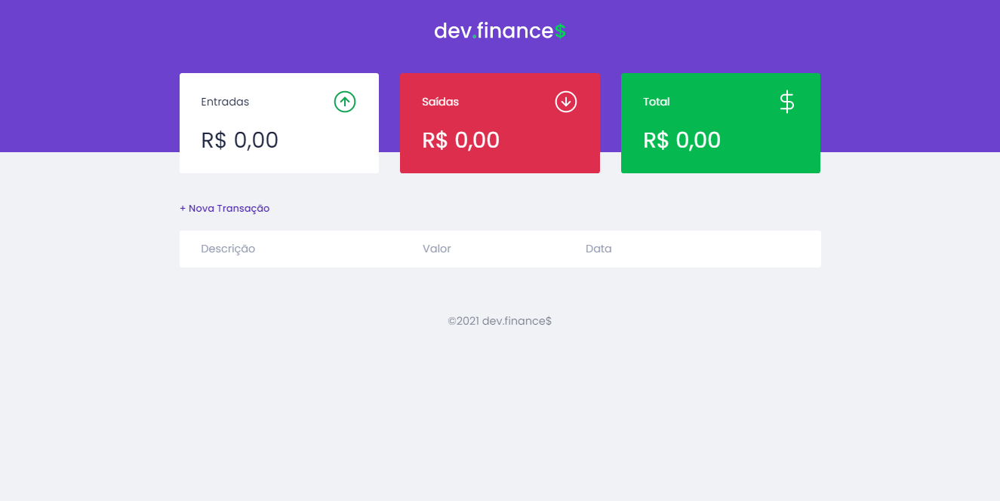

# [Rocketseat](https://rocketseat.com.br/) - MaratonaDiscover#1

**Instrutor**: [Mayk Brito](https://github.com/maykbrito)

  

 

## Projeto: dev.finance$

<h1 align="center">
  
</h1>
 

### 🚀 Tecnologias

Esse projeto foi desenvolvido com as seguintes tecnologias:

- HTML
- CSS
- JavaScript

### 💻 Esboço

O dev.finances é uma aplicação de controle financeiro, onde é possível cadastrar e excluir transações e ver o saldo de entrada e saída 💰

### 🔖 Layout

Você pode visualizar o layout do projeto através [desse link](https://www.figma.com/file/7Vu9DzUaCZIV4nibzkjgB4/dev.finance%24-Maratona-Discover). Lembrando que é necessário ter uma conta no [Figma](https://figma.com) para que você consiga acessá-lo.

  

